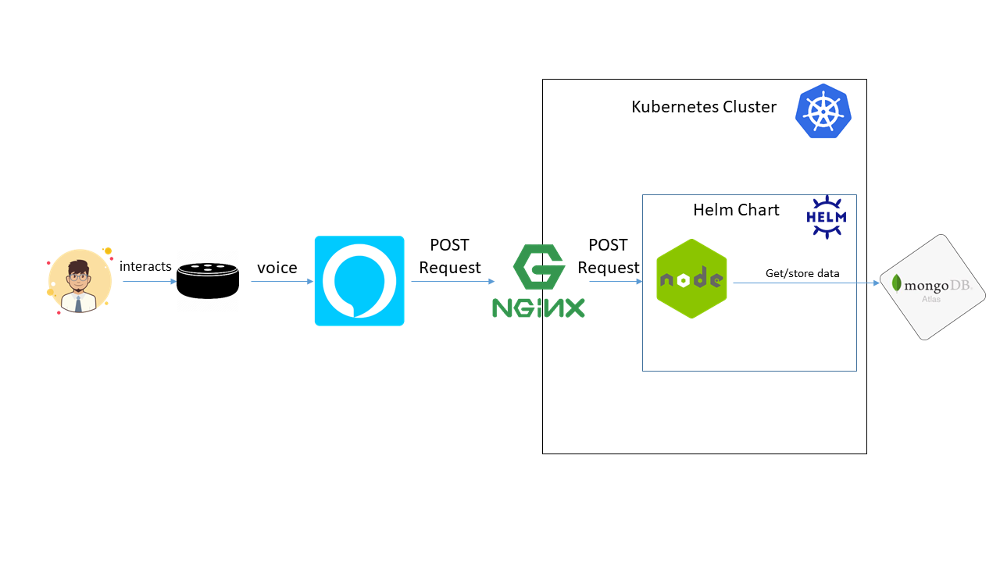
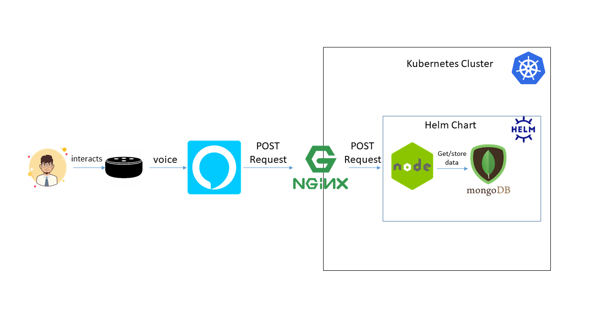

# Alexa Running in Kubernetes

<!-- TOC -->

- [Alexa Running in Kubernetes](#alexa-running-in-kubernetes)
  - [1. Alexa Skill as a web server](#1-alexa-skill-as-a-web-server)
  - [2. MongoDB persistence adapter](#2-mongodb-persistence-adapter)
  - [3. Dockerizing the Alexa Skill](#3-dockerizing-the-alexa-skill)
  - [4. Kubernetes objects of the Alexa Skill](#4-kubernetes-objects-of-the-alexa-skill)
  - [5. Helm chart of the Alexa skill](#5-helm-chart-of-the-alexa-skill)
  - [6. Local development and Deployment with DevSpace](#6-local-development-and-deployment-with-devspace)
  - [7. Terraform.](#7-terraform)
    - [7.1. Deploying the Alexa Skill on AWS Elastic Kubernetes Services](#71-deploying-the-alexa-skill-on-aws-elastic-kubernetes-services)
    - [7.2. Deploying the Alexa Skill on Azure Kubernetes Services](#72-deploying-the-alexa-skill-on-azure-kubernetes-services)
    - [7.3. Deploying the Alexa Skill on Google Kubernetes Engine](#73-deploying-the-alexa-skill-on-google-kubernetes-engine)

<!-- /TOC -->

In this repository you will find all the resources needed to transform or create an Alexa Skill as an NodeJS Express app ready to run on Kubernetes.
These are the two possible options you can use for running your Alexa Skill on kubernetes:

**1. Using Mongo Atlas Cloud Schema**


**2. Using Provided Mongo Schema**


Those multiple options are supported by this implementation.

These are the main folders of the project:

```bash
    ├───.vscode
    ├───alexa-skill
    ├───app
    ├───docker
    ├───helm
    └───terraform
        ├───eks
        ├───aks
        └───gke
```

* **.vscode:** launch preferences to run locally your Skill for local testing.
* **alexa-skill:** this folder contains all the metadata of the Alexa Skill such as the interaction model, assets, Skill manifest, etc. In this folder you will be able to run all the `ask cli` commands.
* **app:** the backend of the Alexa Skill a NodeJS app using Express.
* **docker:** where you can find the Dockerfile of the Alexa Skill backend as a NodeJS app.
* **helm:** the helm chart of the Alexa Skill ready to be deployed on any Kubernetes Cluster.
* **terraform:** Terraform files per different kind of private clouds.
  * **eks:** All the files needed to deploy an Alexa Skill and a Kubernetes Cluster on AWS Elastic Kubernetes Service.
  * **aks:** All the files needed to deploy an Alexa Skill and a Kubernetes Cluster on Azure Kubernetes Service.
  * **gke:** All the files needed to deploy an Alexa Skill and a Kubernetes Cluster on Google Kubernetes Engine.


Let's explaing all the steps required to create an Alexa Skill and deploy it on a Kubernetes cluster.
In each step you will find all the pre-requisites needed for that step.

## 1. Alexa Skill as a web server

How to create an Alexa Skill as a NodeJS app using Express. Check the full explanation [here](docs/WEBSERVER.md).

## 2. MongoDB persistence adapter

Usage of the new MongoDB Persistence adapter. Check the full explanation [here](https://github.com/xavidop/ask-sdk-mongodb-persistence-adapter).

## 3. Dockerizing the Alexa Skill

Dockerizing our Alexa Skill backend transformed into a NodeJS Express app. Check the full explanation [here](docs/DOCKER.md).

## 4. Kubernetes objects of the Alexa Skill

Creating all the Kubernetes objects needed to deploy our Alexa Skill on a Kubernetes cluster. Check the full explanation [here](docs/KUBERNETES.md).

## 5. Helm chart of the Alexa skill

Creating the Helm Chart with our Alexa Skill + MongoDB. Check the full explanation [here](docs/HELM.md).
## 6. Local development and Deployment with DevSpace

How to develop in a Kubernetes environment. Check the full explanation [here](docs/LOCAL_DEVELOPMENT_DEPLOYMENT.md).

## 7. Terraform.

### 7.1. Deploying the Alexa Skill on AWS Elastic Kubernetes Services

How to deploy our Alexa skill in EKS. Check the full explanation [here](docs/TERRAFORM_EKS.md).

### 7.2. Deploying the Alexa Skill on Azure Kubernetes Services

How to deploy our Alexa skill in AKS. Check the full explanation [here](docs/TERRAFORM_AKS.md).

### 7.3. Deploying the Alexa Skill on Google Kubernetes Engine

How to deploy our Alexa skill in GKE. Check the full explanation [here](docs/TERRAFORM_GKE.md).
