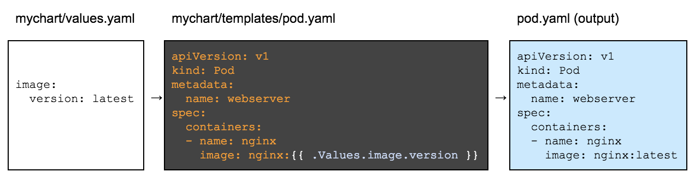

# Alexa and Kubernetes: Helm chart of the Alexa skill

In these step we have our Alexa Skill properly dockerized and all the Kubernetes objects created and running on a Kubernetes cluster. Now it is time to package all the software components (Alexa Skill + MongoDB), in this step we will transform all of our kubernetes objects into templates using Helm and we will add a MongoDB instance ready to be deployed on a Kubernetes cluster as a dependency of our Alexa Skill Helm Chart:


## Prerequisites

Here you have the technologies used in this project
1. Node.js v12.x
2. Visual Studio Code
3. Docker 19.x
4. Kubectl CLI
5. MongoDB Atlas Account
6. Kind
7. go >=1.11
8. Helm v3.x

## Helm chart

In order to design the Alexa Skill Helm Chart, it is important to explain what Helm is. This tool will facilitate the development and the life cycle of the Alexa Skill. It is also a tool used for managing Kubernetes packages. These packages are called Charts.
A chart is a collection of files that describe a set of Kubernetes resources.
With Helm we can perform the following tasks:
* Packaging our applications as Charts.
* Interact with chart repositories (public or private).
* Installing and uninstalling charts in Kubernetes clusters.
* Chart management previously installed with Helm.
In addition, it is a tool for managing packaged and preconfigured Kubernetes resources. In other words, Helm allows you to manage templates that make easy the deployment of any Kubernetes object. Then, it is not necessary to have advanced knowledge of those Kubernetes objects to deploy them.


Our Alexa Skill Chart is located on `helm/alexa-skill-chart`
```bash
├── Chart.yaml
├── README.md
├── requirements.yaml
├── templates
│   ├── deployment.yaml
│   ├── service.yaml
│   ├── ingress.yaml
└── values.yaml
```

The chart of this Alexa Skill would have the following files:
1. Chart.yaml: file with the metadata of the package. Name, version, description. In this file we will indicate the microservice dependencies (MongoDB). Here you can add other charts.
3. Templates: templates files are stored in this directory.
4. values.yml: default values used in templates.

Before we start, as our chart will include a MongoDB as a dependency we will have to add it on our `Chart.yaml` file.

First we need to add the Helm repository where the MongoDB Helm Chart is stored with the following commands:
```bash
helm repo add bitnami https://charts.bitnami.com/bitnami
helm repo update
```
Then we can add the MongoDB chart: https://github.com/bitnami/charts/tree/master/bitnami/mongodb in our our `Chart.yaml` file:

```yaml
apiVersion: v2
name: alexa-skill
description: A Helm chart for Kubernetes

# A chart can be either an 'application' or a 'library' chart.
#
# Application charts are a collection of templates that can be packaged into versioned archives
# to be deployed.
#
# Library charts provide useful utilities or functions for the chart developer. They're included as
# a dependency of application charts to inject those utilities and functions into the rendering
# pipeline. Library charts do not define any templates and therefore cannot be deployed.
type: application

# This is the chart version. This version number should be incremented each time you make changes
# to the chart and its templates, including the app version.
version: 1.0.0

# This is the version number of the application being deployed. This version number should be
# incremented each time you make changes to the application.
appVersion: 1.0.0

dependencies:
- name: mongodb
  version: 10.3.3
  repository: alias:bitnami
  alias: mongodb
  condition: mongodb.enabled
```

## Creating the templates

The image below shows what happens when we use Helm and how it transforms our templates into Kubernetes objects:



Now we will add the Helm layer to allow our alexa Skill to be scalable, extensible, environment-aware, version-aware, incremental, personalised, dynamic, and reusable. Adding this layer means create templates for all of our Kubernetes objects.

### Deployment template

Below you can find the Deployment of our Alexa Skill but know with the Helm layer that allows us to set all the information through the `values.yaml` file.

```yaml
apiVersion: apps/v1
kind: Deployment
metadata:
  name: {{ include "alexa-skill.fullname" . }}
  labels:
    {{- include "alexa-skill.labels" . | nindent 4 }}
spec:
  replicas: {{ .Values.replicaCount }}
  selector:
    matchLabels:
      {{- include "alexa-skill.selectorLabels" . | nindent 6 }}
  template:
    metadata:
      labels:
        {{- include "alexa-skill.selectorLabels" . | nindent 8 }}
    spec:
    {{- with .Values.imagePullSecrets }}
      imagePullSecrets:
        {{- toYaml . | nindent 8 }}
    {{- end }}
      containers:
        - name: {{ .Chart.Name }}
          image: "{{ .Values.image.repo }}/{{ .Values.image.name }}:{{ .Values.image.tag }}"
          imagePullPolicy: {{ .Values.pullPolicy }}
          ports:
            - name: http
              containerPort: {{ .Values.service.NodePort }}
              protocol: TCP
          resources:
            {{- toYaml .Values.resources | nindent 12 }}
          env:
            - name: DB_TYPE
              value: {{ .Values.mongodb.type }}
            - name: DB_HOST
              {{ if eq .Values.mongodb.type "provided" }}
              value: {{ include "alexa-skill.fullname" . }}-{{ .Values.mongodb.service.name }}
              {{ else }}
              value: {{ .Values.mongodb.service.name }}
              {{ end }}
            - name: DB_PORT
              value: "{{ .Values.mongodb.service.port }}"
            - name: DB_USER
              value: {{ .Values.mongodb.auth.username }}
            - name: DB_PASSWORD
              value: {{ .Values.mongodb.auth.password }}
            - name: DB_DATABASE
              value: {{ .Values.mongodb.auth.database }}    
      {{- with .Values.nodeSelector }}
      nodeSelector:
        {{- toYaml . | nindent 8 }}
      {{- end }}
    {{- with .Values.affinity }}
      affinity:
        {{- toYaml . | nindent 8 }}
    {{- end }}
    {{- with .Values.tolerations }}
      tolerations:
        {{- toYaml . | nindent 8 }}
    {{- end }}

```

### Service template

Below you can find the Service of our Alexa Skill but know with the Helm layer that allows us to set all the information through the `values.yaml` file.

```yaml
apiVersion: v1
kind: Service
metadata:
  name: {{ include "alexa-skill.fullname" . }}
  labels:
    {{- include "alexa-skill.labels" . | nindent 4 }}
spec:
  ports:
    - port: {{ .Values.service.port }}
      targetPort: {{ .Values.service.NodePort }}
      protocol: TCP
  selector:
    {{- include "alexa-skill.selectorLabels" . | nindent 4 }}

```


### Ingress template

Below you can find the Ingress of our Alexa Skill but know with the Helm layer that allows us to set all the information through the `values.yaml` file.

```yaml
apiVersion: networking.k8s.io/v1beta1
kind: Ingress
metadata:
  name: {{ .Values.ingress.name }}
  labels:
    {{- include "alexa-skill.labels" . | nindent 4 }}
  annotations:
    # Target URI where the traffic must be redirected
    # More info: https://github.com/kubernetes/ingress-nginx/blob/master/docs/examples/rewrite/README.md
    nginx.ingress.kubernetes.io/rewrite-target: /
    kubernetes.io/ingress.class: nginx
spec:
  rules:
    # Uncomment the below to only allow traffic from this domain and route based on it
    # - host: my-host # your domain name with A record pointing to the nginx-ingress-controller IP
    - http:
        paths:
        - path: / # Everything on this path will be redirected to the rewrite-target
          backend:
            serviceName: {{ include "alexa-skill.fullname" . }} # the exposed svc name and port
            servicePort: {{ .Values.ingress.port }}
```


### Values file

As you can see, all of our Kubernetes objects turns into templates. Those templates need a `values.yaml` file in order to obtain the final Kubernetes object.

If you want to use the **Alexa Skill with the MongoDB provided** in the Alexa Skill Chart:


You can use this `Values` file:

```yaml
# Default values for alexa-skill.
# This is a YAML-formatted file.
# Declare variables to be passed into your templates.

replicaCount: 1

image: 
  repo: xavidop
  name: alexa-skill-nodejs-express
  tag: latest
pullPolicy: Always

imagePullSecrets: []
nameOverride: ""
fullnameOverride: ""

service:
  port: 3000
  NodePort: 3000

ingress:
  enabled: true
  name: alexa-skill-ingress
  port: 3000

resources:
  limits:
    cpu: 50m
    memory: 128Mi
  requests:
    cpu: 50m
    memory: 128Mi

# Mongo provided conneciton
mongodb:
  enabled: true
  type: provided # could be atlas or provided
  auth:
    username: root
    password: root
    database: alexa
    rootPassword: root
  service:
    name: mongodb
    port: 27017

nodeSelector: {}

tolerations: []

affinity: {}
```


If you want to use the A**lexa Skill with the MongoDB Atlas Cloud**:


You can use this `Values` file:

```yaml
# Default values for alexa-skill.
# This is a YAML-formatted file.
# Declare variables to be passed into your templates.

replicaCount: 1

image: 
  repo: xavidop
  name: alexa-skill-nodejs-express
  tag: latest
pullPolicy: Always

imagePullSecrets: []
nameOverride: ""
fullnameOverride: ""

service:
  port: 3000
  NodePort: 3000

ingress:
  enabled: true
  name: alexa-skill-ingress
  port: 3000

resources:
  limits:
    cpu: 50m
    memory: 128Mi
  requests:
    cpu: 50m
    memory: 128Mi

# Atlas connection
mongodb:
  enabled: false
  type: atlas # could be atlas or provided
  auth:
    username: root
    password: root
    database: alexa
  service:
    name: cluster0.qlqga.mongodb.net

nodeSelector: {}

tolerations: []

affinity: {}
```

## Installing the Helm Chart

All the Helm chart is explained. Now we have to install it on our Kind Cluster. For that, we have to run the following command:
```bash
# Update the dependencies
helm dep update helm/alexa-skill-chart/
# Install the chart
helm install alexa-skill helm/alexa-skill-chart/ --namespace alexa-skill
```

If we want to remove oour Chart Installer, just run the following command:
```bash
## Uninstall
helm uninstall alexa-skill --namespace alexa-skill
```

## Testing requests locally

I'm sure you already know the famous tool call [Postman](https://www.postman.com/). REST APIs have become the new standard in providing a public and secure interface for your service. Though REST has become ubiquitous, it's not always easy to test. Postman, makes it easier to test and manage HTTP REST APIs. Postman gives us multiple features to import, test and share APIs, which will help you and your team be more productive in the long run.

After run your application you will have an endpoint available at http://localhost:3008. With Postman you can emulate any Alexa Request. 

For example, you can test a `LaunchRequest`:

```json

  {
    "version": "1.0",
    "session": {
      "new": true,
      "sessionId": "amzn1.echo-api.session.[unique-value-here]",
      "application": {
        "applicationId": "amzn1.ask.skill.[unique-value-here]"
      },
      "user": {
        "userId": "amzn1.ask.account.[unique-value-here]"
      },
      "attributes": {}
    },
    "context": {
      "AudioPlayer": {
        "playerActivity": "IDLE"
      },
      "System": {
        "application": {
          "applicationId": "amzn1.ask.skill.[unique-value-here]"
        },
        "user": {
          "userId": "amzn1.ask.account.[unique-value-here]"
        },
        "device": {
          "supportedInterfaces": {
            "AudioPlayer": {}
          }
        }
      }
    },
    "request": {
      "type": "LaunchRequest",
      "requestId": "amzn1.echo-api.request.[unique-value-here]",
      "timestamp": "2020-03-22T17:24:44Z",
      "locale": "en-US"
    }
  }

```

## Resources
* [Official Alexa Skills Kit Node.js SDK](https://www.npmjs.com/package/ask-sdk) - The Official Node.js SDK Documentation
* [Official Alexa Skills Kit Documentation](https://developer.amazon.com/docs/ask-overviews/build-skills-with-the-alexa-skills-kit.html) - Official Alexa Skills Kit Documentation
* [Official Express Adapter Documentation](https://developer.amazon.com/en-US/docs/alexa/alexa-skills-kit-sdk-for-nodejs/host-web-service.html) - Express Adapter Documentation
* [Official Kind Documentation](https://kind.sigs.k8s.io/) - Kind Documentation
* [Official Kubernetes Documentation](https://kubernetes.io/docs) - Kubernetes Documentation
* [Official Helm Documentation](https://helm.sh/docs/) - Helm Documentation


## Conclusion 

As you can see we have our Alexa Skill running on Kubernetes using templates and packaged as Helm Chart. Thanks to the `Values` file we can change all the key parameters/properties of our Alexa Skill in an easy way.

I hope this example project is useful to you.

That's all folks!

Happy coding!