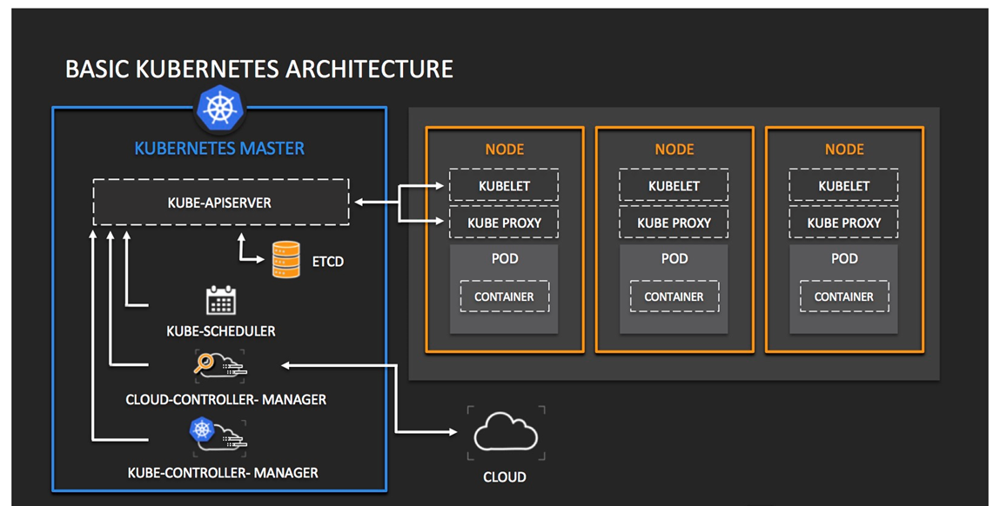
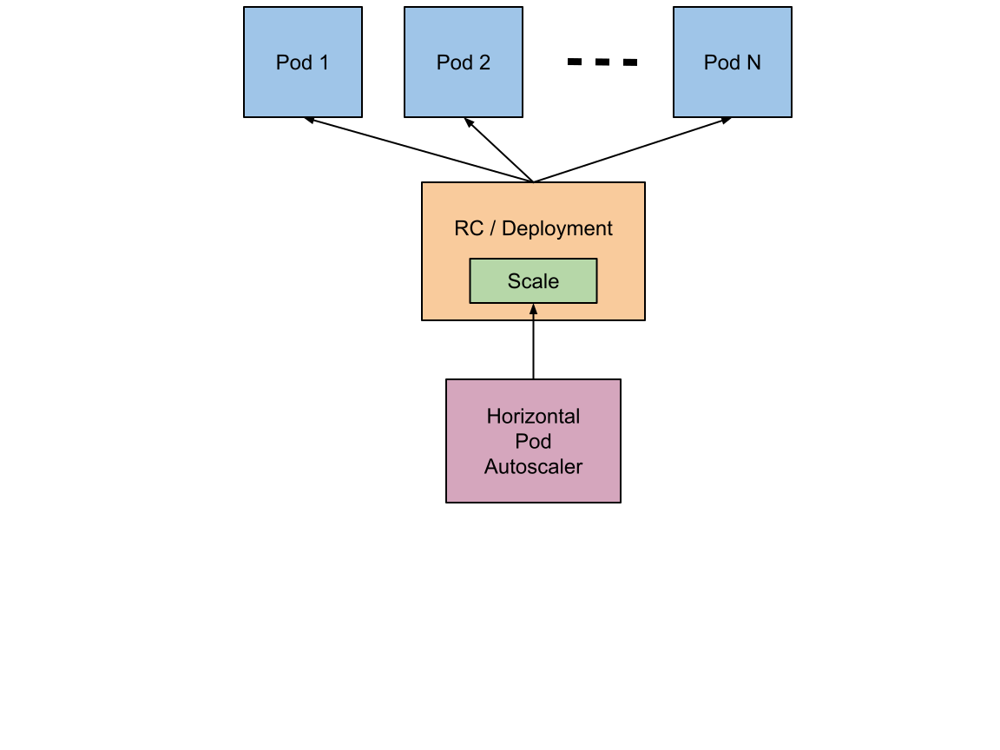
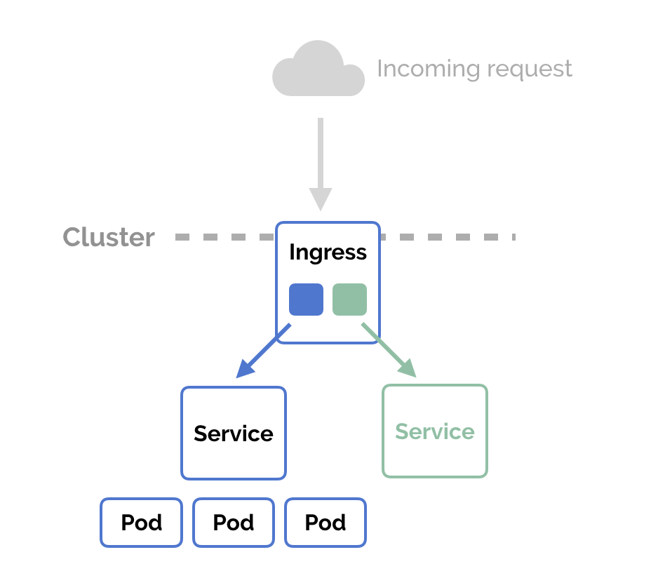

# Alexa and Kubernetes: Kubernetes objects of the Alexa Skill

In these step we have our Alexa Skill properly dockerized. As we are not going to package all the software components (Alexa Skill + MongoDB) yet, in this step we will set up all the kubernetes objects of our Alexa Skill using [MongoDB Atlas](https://cloud.mongodb.com/)


## Prerequisites

Here you have the technologies used in this project
1. Node.js v12.x
2. Visual Studio Code
3. Docker 19.x
4. Kubectl CLI
5. MongoDB Atlas Account
6. Kind
7. go >=1.11

## Creating the Kubernetes cluster with Kind

Ther first thing we need to do is install a Kubernetes cluster on our local machine in order to create all the Kubernetes objects.

For that we are going to use Kind. kind is a tool for running local Kubernetes clusters using Docker container “nodes”.
kind was primarily designed for testing Kubernetes itself, but may be used for local development or CI.

With Kind you can create clusters using an specification YAML file.

```yaml
kind: Cluster
apiVersion: kind.x-k8s.io/v1alpha4
nodes:
- role: control-plane
  kubeadmConfigPatches:
  - |
    kind: InitConfiguration
    nodeRegistration:
      kubeletExtraArgs:
        node-labels: "ingress-ready=true"
  extraPortMappings:
  - containerPort: 80
    hostPort: 3008
    protocol: TCP
  - containerPort: 443
    hostPort: 3009
    protocol: TCP
```

We can leverage Kind's extraPortMapping config option when creating a cluster to forward ports from the host to an ingress controller running on a node. We will expose the port 80 of the Kind cluster to port 3008 of our local machine and the 443 to the port 3009 of our local machine.
This YAML file is located in the root folder called `cluster.yaml`.

You can deploy the cluster running the following commands:
```bash 
kind create cluster --config cluster.yaml

#Get the Kubernetes context to execute kubectl commands
kubectl cluster-info --context kind-kind
``` 

If you want to detroy the cluster, just run the following command:
```bash 
kind delete cluster
``` 

## Creating the Kubernetes objects

The objects that we are going to create are the following Kubernetes objects in order to run our Alexa Skill ready to run on Kubernetes:
**1. Deployment:** the deploymnet is one of the most immportants kubernetes objects. A Deployment provides declarative updates for Pods. A Pod (as in a pod of whales or pea pod) is a group of one or more containers, with shared storage and network resources, and a specification for how to run the containers.
**2. Service:** an abstract way to expose an application running on a set of Pods as a network service
**3. Ingress:** an API object that manages external access to the services in a cluster. It is a layer crated above the Kubernetes services. It requieres an Ingress Controller to manage all the incoming requests.

Here you can find a simple schema of how Kubernetes works:


Our Alexa Skill will be a container running thanks to our Deployment. We will expose the port of the Alexa Skill thanks to the Kubernetes Service object and finally we are going to access to the Alexa Skill through the port exposed thanks to the Kuberntes Ingress object.
### Deployment

You describe a desired state in a Deployment, and the Deployment Controller changes the actual state to the desired state at a controlled rate. You can define Deployments to create new Pods, or to remove existing Deployments and adopt all their resources with new Deployments.

```yaml
apiVersion: apps/v1
kind: Deployment
metadata:
  name: alexa-skill
  labels:
    helm.sh/chart: alexa-skill-1.0.0
    app.kubernetes.io/name: alexa-skill
    app.kubernetes.io/instance: alexa-skill
    app.kubernetes.io/version: "1.0.0"
    app.kubernetes.io/managed-by: Helm
spec:
  replicas: 1
  selector:
    matchLabels:
      app.kubernetes.io/name: alexa-skill
      app.kubernetes.io/instance: alexa-skill
  template:
    metadata:
      labels:
        app.kubernetes.io/name: alexa-skill
        app.kubernetes.io/instance: alexa-skill
    spec:
      containers:
        - name: alexa-skill
          image: "xavidop/alexa-skill-nodejs-express:latest"
          imagePullPolicy: Always
          ports:
            - name: http
              containerPort: 3000
              protocol: TCP
          resources:
            limits:
              cpu: 50m
              memory: 128Mi
            requests:
              cpu: 50m
              memory: 128Mi
          env:
            - name: DB_TYPE
              value: atlas
            - name: DB_HOST      
              value: cluster0.qlqga.mongodb.net         
            - name: DB_PORT
              value: "27017"
            - name: DB_USER
              value: root
            - name: DB_PASSWORD
              value: root
            - name: DB_DATABASE
              value: alexa
```

As you can see, our Deployment will have 1 replica. In case our alexa Skill have a lot of requests, we can update the number of replicas or create a [HorizontalPodAutoscaler](https://kubernetes.io/docs/tasks/run-application/horizontal-pod-autoscale/) Kubernetes object, but his is optional:



Let'see the specification of our Deployment:
1. First thing you will notice is that in the `containers` list we only have one container defined which is our Alexa Skill.
3. the image build in the previous step is set in the `containers.image` object.
4. We expose the cointainer port which is the **3000**. As it is a port that will recieve HTTP requests. The protocol we have to set is `tcp`.
5. We have set the memory of our pod to `128Mi`, it means 128 MegaBytes. In terms of CPU we have set it to `50mi`. It is measured in milicores.
6. In the `env` object we will set all the environment variables and its values that our cointaner will use.

With that we have our deployment ready. This deployment will create a pod with a container.

Finally we have to modify our NodeJS Alexa Skill app to get all the information from the environment varaibles that we have set in the Deploment spececification:

```javascript
const connOpts = {
  host: process.env.DB_HOST ? process.env.DB_HOST : 'cluster0.qlqga.mongodb.net',
  user: process.env.DB_USER ? process.env.DB_USER : 'root',
  port: process.env.DB_PORT ? process.env.DB_PORT : '27017',
  password: process.env.DB_PASSWORD ? process.env.DB_PASSWORD : 'root',
  database: process.env.DB_DATABASE ? '/' + process.env.DB_DATABASE : '',
};

let uri = '';
if (process.env.DB_TYPE === 'atlas'){
  uri = `mongodb+srv://${connOpts.user}:${connOpts.password}@${connOpts.host}${connOpts.database}`;
} else {
  // eslint-disable-next-line max-len
  uri = `mongodb://${connOpts.user}:${connOpts.password}@${connOpts.host}:${connOpts.port}${connOpts.database}`;
}
```

With all the changes done, we only have to deploy our Deployment running the following command:

```bash
#Create Namespace
kubectl create namespace alexa-skill

#Create deployment
kubectl apply -f deployment.yaml
```

### Service

The next step is to create the Kubernetes Service. With Kubernetes you don't need to modify your application to use an unfamiliar service discovery mechanism. Kubernetes gives Pods their own IP addresses and a single DNS name for a set of Pods, and can load-balance across them

```yaml
apiVersion: v1
kind: Service
metadata:
  name: alexa-skill
  labels:
    helm.sh/chart: alexa-skill-1.0.0
    app.kubernetes.io/name: alexa-skill
    app.kubernetes.io/instance: alexa-skill
    app.kubernetes.io/version: "1.0.0"
    app.kubernetes.io/managed-by: Helm
spec:
  ports:
    - port: 3000
      targetPort: 3000
      protocol: TCP
  selector:
    app.kubernetes.io/name: alexa-skill
    app.kubernetes.io/instance: alexa-skill
```

The important thing here are the `port`, `targetPort` and `protocol` specifications:
**1. port:** The port is the port that will use the Kubernetes Service.
**2. targetPort:** the port of the container. This property links the container port running in the pod with the service.
**3. protocol:** the protocol of the port. We will use `TCP` because this service will recieve HTTP requests.

By default a type of a service is `ClusterIP`.Exposes the Service on a cluster-internal IP. Choosing this value makes the Service only reachable from within the cluster

With all the changes done, we only have to deploy our Service running the following command:

```bash
kubectl apply -f service.yaml
```

### Ingress

Ingress exposes HTTP and HTTPS routes from outside the cluster to services within the cluster. Traffic routing is controlled by rules defined on the Ingress resource. An Ingress may be configured to give Services externally-reachable URLs, load balance traffic, terminate SSL / TLS, and offer name-based virtual hosting. An Ingress controller is responsible for fulfilling the Ingress, usually with a load balancer, though it may also configure your edge router or additional frontends to help handle the traffic.



An Ingress requires an Ingress controller. As we can see in the schema in the top of this markdown, we will use the Nginx Ingress Controller.

To install this Ingress Controller on our Kind Cluster we have to run the following command:

```bash
kubectl apply -f https://raw.githubusercontent.com/kubernetes/ingress-nginx/master/deploy/static/provider/kind/deploy.yaml
```

Once the pods of the Nginx Ingress Controller are up and running, we can create our Ingress:

```yaml
apiVersion: networking.k8s.io/v1beta1
kind: Ingress
metadata:
  name: alexa-skill-ingress
  labels:
    helm.sh/chart: alexa-skill-1.0.0
    app.kubernetes.io/name: alexa-skill
    app.kubernetes.io/instance: alexa-skill
    app.kubernetes.io/version: "1.0.0"
    app.kubernetes.io/managed-by: Helm
  annotations:
    # Target URI where the traffic must be redirected
    # More info: https://github.com/kubernetes/ingress-nginx/blob/master/docs/examples/rewrite/README.md
    nginx.ingress.kubernetes.io/rewrite-target: /
    kubernetes.io/ingress.class: nginx
spec:
  rules:
    # Uncomment the below to only allow traffic from this domain and route based on it
    # - host: my-host # your domain name with A record pointing to the nginx-ingress-controller IP
    - http:
        paths:
        - path: / # Everything on this path will be redirected to the rewrite-target
          backend:
            serviceName: alexa-skill # the exposed svc name and port
            servicePort: 3000
```
We can see in the Ingress specification that all the requests to the URI `/` will be managed by this Ingress. This Ingress is linked to the Kubernetes Service through the `serviceName` and `servicePort` properties.

With all the changes done, we only have to deploy our Ingress running the following command:

```bash
kubectl apply -f ingress.yaml
```

## Testing requests locally

I'm sure you already know the famous tool call [Postman](https://www.postman.com/). REST APIs have become the new standard in providing a public and secure interface for your service. Though REST has become ubiquitous, it's not always easy to test. Postman, makes it easier to test and manage HTTP REST APIs. Postman gives us multiple features to import, test and share APIs, which will help you and your team be more productive in the long run.

After run your application you will have an endpoint available at http://localhost:3008. With Postman you can emulate any Alexa Request. 

For example, you can test a `LaunchRequest`:

```json

  {
    "version": "1.0",
    "session": {
      "new": true,
      "sessionId": "amzn1.echo-api.session.[unique-value-here]",
      "application": {
        "applicationId": "amzn1.ask.skill.[unique-value-here]"
      },
      "user": {
        "userId": "amzn1.ask.account.[unique-value-here]"
      },
      "attributes": {}
    },
    "context": {
      "AudioPlayer": {
        "playerActivity": "IDLE"
      },
      "System": {
        "application": {
          "applicationId": "amzn1.ask.skill.[unique-value-here]"
        },
        "user": {
          "userId": "amzn1.ask.account.[unique-value-here]"
        },
        "device": {
          "supportedInterfaces": {
            "AudioPlayer": {}
          }
        }
      }
    },
    "request": {
      "type": "LaunchRequest",
      "requestId": "amzn1.echo-api.request.[unique-value-here]",
      "timestamp": "2020-03-22T17:24:44Z",
      "locale": "en-US"
    }
  }

```

## Resources
* [Official Alexa Skills Kit Node.js SDK](https://www.npmjs.com/package/ask-sdk) - The Official Node.js SDK Documentation
* [Official Alexa Skills Kit Documentation](https://developer.amazon.com/docs/ask-overviews/build-skills-with-the-alexa-skills-kit.html) - Official Alexa Skills Kit Documentation
* [Official Express Adapter Documentation](https://developer.amazon.com/en-US/docs/alexa/alexa-skills-kit-sdk-for-nodejs/host-web-service.html) - Express Adapter Documentation
* [Official Kind Documentation](https://kind.sigs.k8s.io/) - Kind Documentation
* [Official Kubernetes Documentation](https://kubernetes.io/docs) - Kubernetes Documentation

## Conclusion 

Now we have our Alexa Skill running in a kubernetes server locally and using Mongo Atlas cloud. Now we have to package all the Kubernetes objects using Helm.

I hope this example project is useful to you.

That's all folks!

Happy coding!
