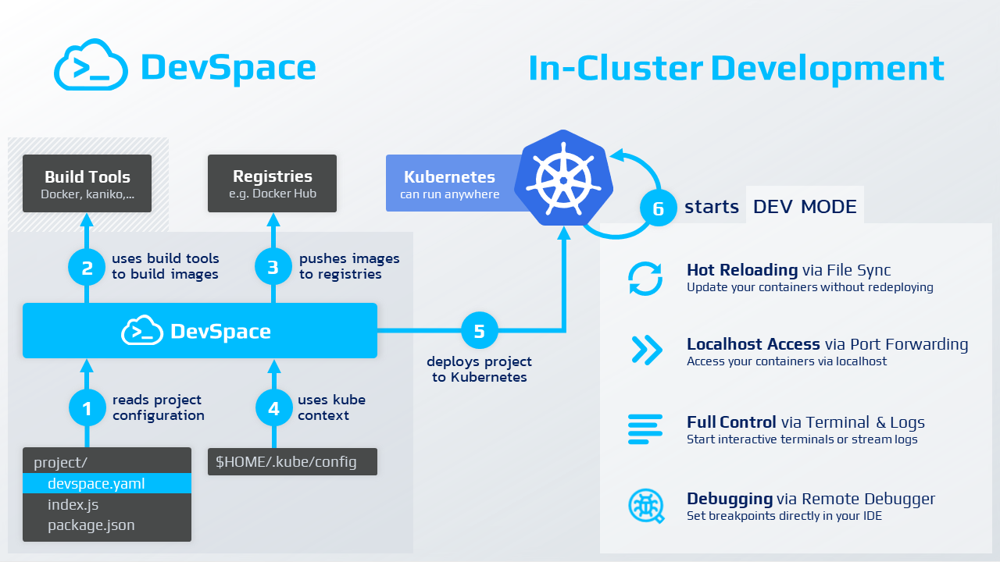
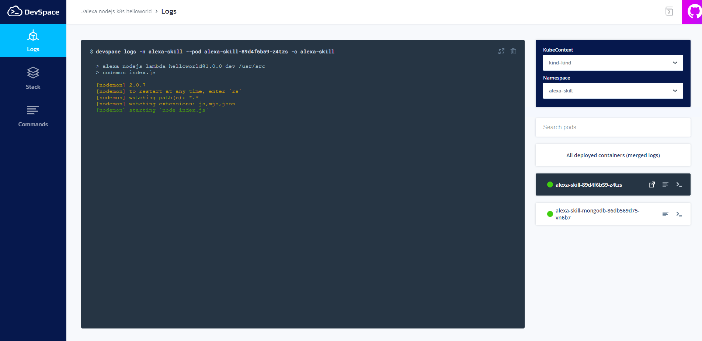
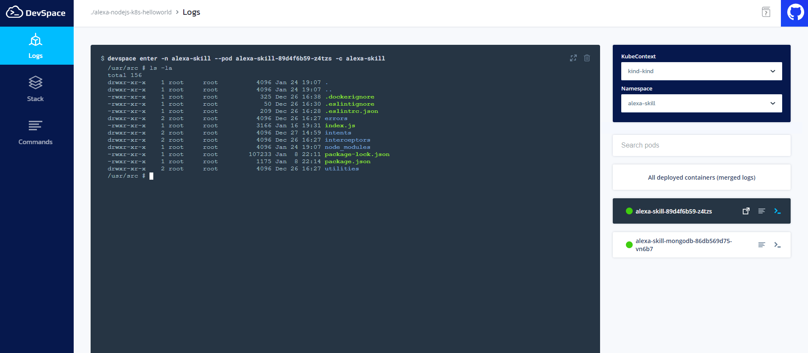
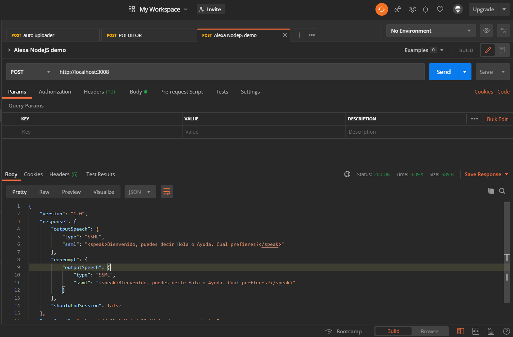
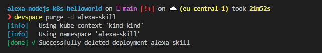

# Alexa and Kubernetes: Local development and Deployment with DevSpace

It is a fact that the development process in a Kubernetes environment is not easy. There are a lot of tools that help us in this process. For this use case we are going to use DevSpace. A tool for developers that makes the Kubernetes lifecycle easier.


## Prerequisites

Here you have the technologies used in this project
1. Node.js v12.x
2. Visual Studio Code
3. Docker 19.x
4. Kubectl CLI
5. MongoDB Atlas Account
6. Kind
7. go >=1.11
8. DevSpace CLI
## Devspace

DevSpace is a client-only, open-source developer tool for Kubernetes:

* Build, test and debug applications directly inside Kubernetes
* Develop with hot reloading: updates your running containers without rebuilding images or restarting containers
* Unify deployment workflows within your team and across dev, staging and production
* Automate repetitive tasks for image building and deployment

This os how DevSpace works:



### Benefits

Mentioning the DevSpace documentation:
DevSpace allows you to store all your workflows in one declarative config file: `devspace.yaml`

* Codify workflow knowledge about building images, deploying your project and its dependencies etc.
* Version your workflows together with your code (i.e. you can get any old version up and running with just a single command)
* Share your workflows with your team mates

DevSpace helps your team to standardize deployment and development workflows without requiring everyone on your team to become a Kubernetes expert.

* The DevOps and Kubernetes expert on your team can configure DevSpace using `devspace.yaml` and simply commits it via git
* If other developers on your team check out the project, they only need to run devspace deploy to deploy the project (including image building and deployment of other related project etc.) and they have a running instance of the project
* The configuration of DevSpace is highly dynamic, so you can configure everything using config variables that make it much easier to have one base configuration but still allow differences among developers (e.g. different sub-domains for testing)

Instead of rebuilding images and redeploying containers, DevSpace allows you to hot reload running containers while you are coding:

* Simply edit your files with your IDE and see how your application reloads within the running container.
* The high performance, bi-directional file synchronization detects code changes immediately and synchronizes files immediately between your local dev environment and the containers running in Kubernetes
* Stream logs, connect debuggers or open a container terminal directly from your IDE with just a single command.

Deploying and debugging services with Kubernetes requires a lot of knowledge and forces you to repeatedly run commands like kubectl get pod and copy pod ids back and forth. Stop wasting time and let DevSpace automate the tedious parts of working with Kubernetes:

* DevSpace lets you build multiple images in parallel, tag them automatically and deploy your entire application (including its dependencies) with just a single command
* Let DevSpace automatically start port-fowarding and log streaming, so you don't have to constantly copy and paste pod ids or run 10 commands to get everything started.

DevSpace is battle tested with many Kubernetes distributions including:

* Local Kubernetes clusters like minikube, k3s, MikroK8s, kind
* Managed Kubernetes clusters in GKE (Google), EKS (AWS), AKS (Azure), DOKS (Digital Ocean)
* Self-managed Kubernetes clusters (e.g. created with Rancher)

**The most important thing of DevSpace is that DevSpace is cloud agnostic. That means that it depends on your Kubernetes context!.**
## Configuration file

Once DevSpace has been explained, let's take a look to our DevSpace configuration file: `devspace.yaml`:
```yaml
version: v1beta9

images:
  app:
    image: xavidop/alexa-skill-nodejs-express
    dockerfile: ./docker/Dockerfile
    preferSyncOverRebuild: true
    entrypoint:
    - npm
    - run
    - dev

deployments:
- name: alexa-skill
  helm:
    chart:
      name: ./helm/alexa-skill-chart
    values:
      image:
        tag: tag(xavidop/alexa-skill-nodejs-express)

dev:
  open:
  - url: http://localhost:3000
  autoReload:
    paths:
    - ./app/package.json
    - ./docker/Dockerfile
  sync:
  - imageName: app
    disableDownload: true
    localSubPath: ./app
    excludePaths:
    - ./node_modules

```

Let's take a look at this file step by step:
**1. `images`:** here we are going to specify the name of the image that we are going to use and where the `Dockerfile` is stored. One cool ffeature of DevSpace is that you can overwrite the entrypoint of our Docker Image for debugging.
**1. `deployments`:** here we can specify all the deployment we want to deploy in our Kubernetes cluster. Here you can specify Helm charts with is values, Kubernetes objects or Component Helm Charts. This one are charts made on the fly.
**1. `dev`:** here we will specify all the configuration that we need for develop our applications. In this example we specify the auto reload of the Docker image when there is a change on the `package.json` and the `Dockerfile` files. Then we specify the sync folder that we want to keep synced between our machine and the Kubernetes Cluster.

One of the cool features that has DevSpace is that if we have any deployment dependencies with other GIT repos, we can add it down `dependencies` object in the YAML config file like this:

```yaml
dependencies:
- source:
    git: https://github.com/my-api-server
    branch: stable
- source:
    git: https://github.com/my-auth-server
    revision: c967392
  profile: production
- source:
    git: https://github.com/my-database-server
    tag: v3.0.1
    subPath: /configuration
```
## Start deployment and development

We have the configuration file properly filled. Now we have to run the following commands to start our development with DevSpace:
```bash
devspace use namespace alexa-skill
devspace dev
```

When DevSpace is running and everything is deployed and all the files synced, DevSpace creates a WebUI where we can explore our deployment. The web is availabele in http://localhost:8090/

For Example we can see the logs of our pods:



Or we can run a shell terminal inside our pods directly through the website:



Now we can start developing our Alexa Skill locally and synced automatically with our Kubernetes Cluster thanks to DevSpace
## Testing requests

I'm sure you already know the famous tool call [Postman](https://www.postman.com/). REST APIs have become the new standard in providing a public and secure interface for your service. Though REST has become ubiquitous, it's not always easy to test. Postman, makes it easier to test and manage HTTP REST APIs. Postman gives us multiple features to import, test and share APIs, which will help you and your team be more productive in the long run.

After run your application you will have an endpoint available at http://localhost:3008. With Postman you can emulate any Alexa Request. 

For example, you can test a `LaunchRequest`:

```json

  {
    "version": "1.0",
    "session": {
      "new": true,
      "sessionId": "amzn1.echo-api.session.[unique-value-here]",
      "application": {
        "applicationId": "amzn1.ask.skill.[unique-value-here]"
      },
      "user": {
        "userId": "amzn1.ask.account.[unique-value-here]"
      },
      "attributes": {}
    },
    "context": {
      "AudioPlayer": {
        "playerActivity": "IDLE"
      },
      "System": {
        "application": {
          "applicationId": "amzn1.ask.skill.[unique-value-here]"
        },
        "user": {
          "userId": "amzn1.ask.account.[unique-value-here]"
        },
        "device": {
          "supportedInterfaces": {
            "AudioPlayer": {}
          }
        }
      }
    },
    "request": {
      "type": "LaunchRequest",
      "requestId": "amzn1.echo-api.request.[unique-value-here]",
      "timestamp": "2020-03-22T17:24:44Z",
      "locale": "en-US"
    }
  }
```



## Destroy and stop de development

If we want to remove all the stack created by DevSpace, just run:
```bash
devspace purge -d alexa-skill
```



## Resources
* [Official Alexa Skills Kit Node.js SDK](https://www.npmjs.com/package/ask-sdk) - The Official Node.js SDK Documentation
* [Official Alexa Skills Kit Documentation](https://developer.amazon.com/docs/ask-overviews/build-skills-with-the-alexa-skills-kit.html) - Official Alexa Skills Kit Documentation
* [Official Express Adapter Documentation](https://developer.amazon.com/en-US/docs/alexa/alexa-skills-kit-sdk-for-nodejs/host-web-service.html) - Express Adapter Documentation
* [Official Kind Documentation](https://kind.sigs.k8s.io/) - Kind Documentation
* [Official Kubernetes Documentation](https://kubernetes.io/docs) - Kubernetes Documentation
* [Devspace Documentation](https://devspace.sh/cli/docs/introduction) - Devspace Documentation
## Conclusion 

As you can see DevSpace makes our development process in a Kubernetes cluster easier. With just a configuration file and 3 commands we have all set up and we can start developing our Alexa Skill.

I hope this example project is useful to you.

That's all folks!

Happy coding!

