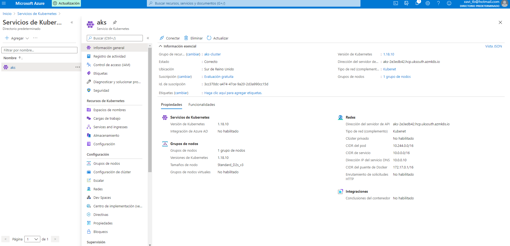
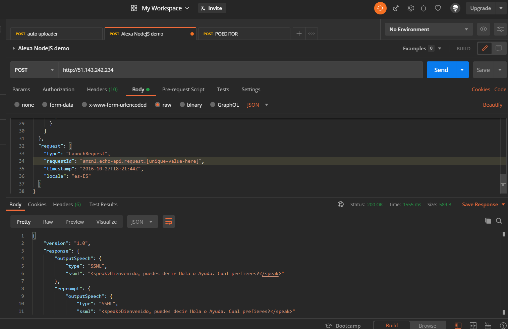

# Alexa and Kubernetes: Deploying the Alexa Skill on Azure Kubernetes Services

Now we have everything prepared and ready to go to a Kubernetes Cluster in a cloud provider. It is a fact that create a cluster in any cloud provider manually ias a hard task. Moreover if we want to automate this deplyoments we need something that help us in this tedious task. In this Markdown we will see how to create a Kubernetes Cluster and all of its required objects and deploying our Alexa Skill with Terraform using [Azure Kubernetes Services](https://azure.microsoft.com/en-us/services/kubernetes-service/)


## Prerequisites

Here you have the technologies used in this project
1. Node.js v12.x
2. Visual Studio Code
3. Docker 19.x
4. Kubectl CLI
5. MongoDB Atlas Account
6. Kind
7. go >=1.11
8. Terraform 12.x
9. Azure Account
10. Azure CLI

## Terraform

Terraform is a tool for building, changing, and versioning infrastructure safely and efficiently. Terraform can manage existing and popular service providers as well as custom in-house solutions.

Configuration files describe to Terraform the components needed to run a single application or your entire datacenter. Terraform generates an execution plan describing what it will do to reach the desired state, and then executes it to build the described infrastructure. As the configuration changes, Terraform is able to determine what changed and create incremental execution plans which can be applied.

The infrastructure Terraform can manage includes low-level components such as compute instances, storage, and networking, as well as high-level components such as DNS entries, SaaS features, etc.
## Terraform files

After the brief overview of Terraform, we are going to explaing all the terraform files and its objects tat we are going to use to deploy de cluster and our Alexa Skill. 
You can find all the files related to this deployment in `terraform/aks` folder.

### Terraform Providers

A provider is responsible for understanding API interactions and exposing resources.
Most of the available providers correspond to one cloud or on-premises infrastructure platform and offers resource types that correspond to each of the features of that platform.

For the Azure Kubernetes Service, we will use the `azurerm` provider. This provider allow us to create all Azure objects that we need to create our Alexa Skill Stack:
```hcl
provider "azurerm" {
  features {}
}
```

As we are going to deploy Helm Charts, it will be required to have the `helm` provider:
```hcl
provider "helm" {
  kubernetes {
    host = azurerm_kubernetes_cluster.cluster.kube_config[0].host
    
    client_key             = base64decode(azurerm_kubernetes_cluster.cluster.kube_config[0].client_key)
    client_certificate     = base64decode(azurerm_kubernetes_cluster.cluster.kube_config[0].client_certificate)
    cluster_ca_certificate = base64decode(azurerm_kubernetes_cluster.cluster.kube_config[0].cluster_ca_certificate)
  }
}

```


### Terraform Resources

Once the Private cloud Network has been created, we can create te cluster that will use that VPC. For that, we need to use the `azurerm_resource_group` module:
```hcl
resource "azurerm_resource_group" "rg" {
  name     = "aks-cluster"
  location = "uksouth"
}
```

Once the Resource Group has been created, we can create te cluster that will use that RG. For that, we need to use the `azurerm_kubernetes_cluster` module:
```hcl
resource "azurerm_kubernetes_cluster" "cluster" {
  name       = "aks"
  location   = azurerm_resource_group.rg.location
  dns_prefix = "aks"

  resource_group_name = azurerm_resource_group.rg.name
  kubernetes_version  = "1.18.10"

  default_node_pool {
    name       = "aks"
    node_count = "1"
    vm_size    = "Standard_D2s_v3"
  }

  service_principal {
    client_id     = var.appId
    client_secret = var.password
  }

  addon_profile {
    kube_dashboard {
      enabled = true
    }
  }
}
```

All the resources and modules commented above are related to the Kubernetes cluster. Now it's time to deploy our Alexa Skill starting with the `ngingx-ingress-controller`:
```hcl
resource "helm_release" "ingress" {
  name       = "nginx-ingress-controller"
  chart      = "nginx-ingress-controller"
  repository = "https://charts.bitnami.com/bitnami"

  set {
    name  = "rbac.create"
    value = "true"
  }
}
```

Aftear that, we can proudly deploy our alexa Skill Helm chart in our Kubernetes Cloud cluster:
```hcl
resource "helm_release" "alexa-skill" {
  name       = "alexa-skill"
  chart      = "../../helm/alexa-skill-chart"
  depends_on = [helm_release.ingress]
}
```

### Terraform Variables

We have provided some variables that you can modify easily in order to change the name of the app_id or the password of this Azure app. For that you can modify the variables on `terraform.tfvars`:
```properties
appId    = "your-appid"
password = "your-password"
```

To create an Azure Service Principal using the `az` cli and getting the password for that Service Principal. Terraform needs a Service Principal to create resources on your behalf.
You can think of it as a user identity (login and password) with a specific role, and tightly controlled permissions to access your resources.
It could have fine-grained permissions such as only to create virtual machines or read from a particular blob storage.

For that, we need to execute the following commands:
```bash
az login
az account list
az ad sp create-for-rbac --role="Contributor"  --scopes="/subscriptions/YOUR_ID"
```

## Deploying the Stack

In order to make a provider available on Terraform, we need to make a `terraform init`, these commands download any plugins we need for our providers.
After that, we have to execute `terraform plan`. The terraform plan command is used to create an execution plan.
It will not modify things in infrastructure.
Terraform performs a refresh, unless explicitly disabled, and then determines what actions are necessary to achieve the desired state specified in the configuration files.
This command is a convenient way to check whether the execution plan for a set of changes matches your expectations without making any changes to real resources or to the state.
Then, we need to execute `terraform apply`. The terraform apply command is used to apply the changes required to reach the desired state of the configuration.
Terraform apply will also write data to the terraform.tfstate file.
Once the application is completed, resources are immediately available.

Here you have the full command list:
```bash
terraform init
terraform plan
terraform appyly
```

After running the `terraform apply`, we can take a look to Azure Kubernetes Service to see that our cluster now appears:


We need to wait like 10 minutes until the cluster is created. Once the cluster is created now we can see the full specifications:


After the cluster creation, Terraform will deploy all the Helm charts. Here you can see all the Kubernetes Pods deployed:


And here the Kubernetes Services and the external IP of the `nginx-ingress-controller`. That IP is the one we are going to use to make Alexa requests:


## Testing requests

I'm sure you already know the famous tool call [Postman](https://www.postman.com/). REST APIs have become the new standard in providing a public and secure interface for your service. Though REST has become ubiquitous, it's not always easy to test. Postman, makes it easier to test and manage HTTP REST APIs. Postman gives us multiple features to import, test and share APIs, which will help you and your team be more productive in the long run.

After run your application you will have an endpoint available at http://51.143.242.234. With Postman you can emulate any Alexa Request. 

For example, you can test a `LaunchRequest`:

```json

  {
    "version": "1.0",
    "session": {
      "new": true,
      "sessionId": "amzn1.echo-api.session.[unique-value-here]",
      "application": {
        "applicationId": "amzn1.ask.skill.[unique-value-here]"
      },
      "user": {
        "userId": "amzn1.ask.account.[unique-value-here]"
      },
      "attributes": {}
    },
    "context": {
      "AudioPlayer": {
        "playerActivity": "IDLE"
      },
      "System": {
        "application": {
          "applicationId": "amzn1.ask.skill.[unique-value-here]"
        },
        "user": {
          "userId": "amzn1.ask.account.[unique-value-here]"
        },
        "device": {
          "supportedInterfaces": {
            "AudioPlayer": {}
          }
        }
      }
    },
    "request": {
      "type": "LaunchRequest",
      "requestId": "amzn1.echo-api.request.[unique-value-here]",
      "timestamp": "2020-03-22T17:24:44Z",
      "locale": "en-US"
    }
  }

```


## Destroy the Stack

If we want to remove all the stack created by Terraform, just run:
```bash
terraform destroy
```
## Resources
* [Official Alexa Skills Kit Node.js SDK](https://www.npmjs.com/package/ask-sdk) - The Official Node.js SDK Documentation
* [Official Alexa Skills Kit Documentation](https://developer.amazon.com/docs/ask-overviews/build-skills-with-the-alexa-skills-kit.html) - Official Alexa Skills Kit Documentation
* [Official Express Adapter Documentation](https://developer.amazon.com/en-US/docs/alexa/alexa-skills-kit-sdk-for-nodejs/host-web-service.html) - Express Adapter Documentation
* [Official Kind Documentation](https://kind.sigs.k8s.io/) - Kind Documentation
* [Official Kubernetes Documentation](https://kubernetes.io/docs) - Kubernetes Documentation
* [Terraform AKS](https://learnk8s.io/blog/get-start-terraform-aks) - Terraform AKS
* [Terraform AKS Github](https://github.com/learnk8s/terraform-aks/tree/master/03-aks-helm) - Terraform AKS GitHub
## Conclusion 

Now we have our Alexa Skill running in a Kubernetes Cluster of our cloud provider everything automated with Terraform and ready to use in our live Alexa Skills.

I hope this example project is useful to you.

That's all folks!

Happy coding!