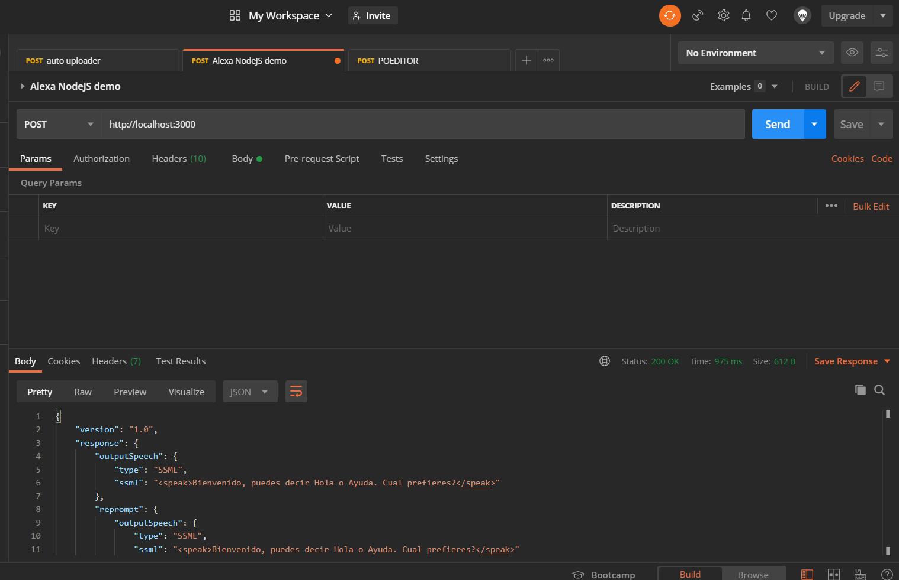

# Alexa and Kubernetes: Alexa Skill as a web server

The very first task we have to do to run our Alexa Skill in a kubernetes environment is to transform our Alexa Skill backend into a NodeJS app running in an Express Web server.

You can build a custom skill for Alexa by implementing a web service that accepts requests from and sends responses to the Alexa service in the cloud.
The web service must meet certain requirements to handle requests sent by Alexa and adhere to the Alexa Skills Kit interface standards. 

## Prerequisites

Here you have the technologies used in this project
1. Node.js v12.x
2. Visual Studio Code
3. Postman

## NodeJS Express server

As Wikipedia says, Express.js, or simply Express, is a backend web application framework for Node.js, released as free and open-source software under the MIT License. It is designed for building web applications and APIs. It has been called the de facto standard server framework for Node.js.

The original author, TJ Holowaychuk, described it as a Sinatra-inspired server, meaning that it is relatively minimal with many features available as plugins. Express is the back-end component of the MEAN stack, together with the MongoDB database software and AngularJS front-end framework.

## Installation

The first step we need to install is the `express` dependency. This will enable us to configure and run the Express Web Server

```bash
    npm install express
```

Once we have installed the Express Web Server, we need to intall the official `ask-sdk-express-adapter`.
This package will help us to run the Alexa Skill instance from the `Alexa.SkillBuilders` object in an Express Web Server creating a request handler to execute all the incoming requests.

```bash
    npm install ask-sdk-express-adapter
```

## Configuration

Once we have all the packages installed now we have to configure it. It is a fact that the Amazon Alexa team has made a huge effort on the express adapter.
This is because of tranform an Alexa Skill backends that are an AWS Lambda into an Express Web Server app takes only 4 lines of code.

This is a typical AWS Lambda backend of an Alexa Skill:

```javascript
const Alexa = require('ask-sdk-core');

exports.handler = Alexa.SkillBuilders.custom()
  .addRequestHandlers(
    LaunchRequestHandler,
    HelloWorldIntentHandler,
    HelpIntentHandler,
    CancelAndStopIntentHandler,
    FallbackIntentHandler,
    SessionEndedRequestHandler,
    IntentReflectorHandler)
  .addErrorHandlers(
    ErrorHandler)
  .addRequestInterceptors(
    LocalisationRequestInterceptor)
  .lambda();
```

And this is Express Web server backend of an Alexa Skill:

```javascript
const Alexa = require('ask-sdk-core');
const express = require('express');
const { ExpressAdapter } = require('ask-sdk-express-adapter');

const skill = Alexa.SkillBuilders.custom()
  .addRequestHandlers(
    LaunchRequestHandler,
    HelloWorldIntentHandler,
    HelpIntentHandler,
    CancelAndStopIntentHandler,
    FallbackIntentHandler,
    SessionEndedRequestHandler,
    IntentReflectorHandler)
  .addErrorHandlers(
    ErrorHandler)
  .withPersistenceAdapter(adapter)
  .addRequestInterceptors(
    LocalisationRequestInterceptor)
  .create();

const app = express();
const expressAdapter = new ExpressAdapter(skill, false, false);
app.post('/', expressAdapter.getRequestHandlers());
app.listen(3000);

```

As you can see above, instead of calling the method `lambda()` and exporting that object, we will call the method `create()` requieres for the Express adapter.
After that, we will create an instance of the express. 
Then we are going to set up the Express adapter creating a new instance of the `ExpressAdapter` that has 3 parameters:
1. The Alexa Skill object the we have obtain after calling the `create()` method.
2. A boolean that enables/disables the verification of the request Signature.
3. A boolean that enable/disable the verification of the request Timestamp.

Now we have the Express adapter created. With the method `post` of the `app` object we create a POST listener. This method has two parameters:
1. The URI the Express will listen to.
2. The handler that will manage all the requests to that URI. Here we are going to use the handler provided calling the method `getRequestHandlers()` of the Express adapter.

Everything is set, now we just have to call the method `listen` with the port the Express server will use to run our Web server.

You can find all the code on the `app` folder.

## Running and Debugging the Skill with Visual Studio Code

The `launch.json` file in `.vscode` folder has the configuration for Visual Studio Code which allow us to run our Express Server locally:

```json

{
    "version": "0.2.0",
    "configurations": [
        {
            "type": "node",
            "request": "launch",
            "name": "Launch Skill",
            "program": "${workspaceRoot}/app/index.js"
        }
    ]
}

```

After configuring our launch.json file, it is time to click on the play button:



After executing it, you can send Alexa POST requests to http://localhost:3000.

## Testing requests locally

I'm sure you already know the famous tool call [Postman](https://www.postman.com/). REST APIs have become the new standard in providing a public and secure interface for your service. Though REST has become ubiquitous, it's not always easy to test. Postman, makes it easier to test and manage HTTP REST APIs. Postman gives us multiple features to import, test and share APIs, which will help you and your team be more productive in the long run.

After run your application you will have an endpoint available at http://localhost:3000. With Postman you can emulate any Alexa Request. 

For example, you can test a `LaunchRequest`:

```json

  {
    "version": "1.0",
    "session": {
      "new": true,
      "sessionId": "amzn1.echo-api.session.[unique-value-here]",
      "application": {
        "applicationId": "amzn1.ask.skill.[unique-value-here]"
      },
      "user": {
        "userId": "amzn1.ask.account.[unique-value-here]"
      },
      "attributes": {}
    },
    "context": {
      "AudioPlayer": {
        "playerActivity": "IDLE"
      },
      "System": {
        "application": {
          "applicationId": "amzn1.ask.skill.[unique-value-here]"
        },
        "user": {
          "userId": "amzn1.ask.account.[unique-value-here]"
        },
        "device": {
          "supportedInterfaces": {
            "AudioPlayer": {}
          }
        }
      }
    },
    "request": {
      "type": "LaunchRequest",
      "requestId": "amzn1.echo-api.request.[unique-value-here]",
      "timestamp": "2020-03-22T17:24:44Z",
      "locale": "en-US"
    }
  }

```

## Resources
* [Official Alexa Skills Kit Node.js SDK](https://www.npmjs.com/package/ask-sdk) - The Official Node.js SDK Documentation
* [Official Alexa Skills Kit Documentation](https://developer.amazon.com/docs/ask-overviews/build-skills-with-the-alexa-skills-kit.html) - Official Alexa Skills Kit Documentation
* [Official Express Adapter Documentation](https://developer.amazon.com/en-US/docs/alexa/alexa-skills-kit-sdk-for-nodejs/host-web-service.html) - Express Adapter Documentation

## Conclusion 

As you can see with just 4 lines of code we transform an Alexa Skill using AWS Lambda into an Express app thanks to the Amazon Alexa team and its fabulous adapter.

I hope this example project is useful to you.

That's all folks!

Happy coding!
